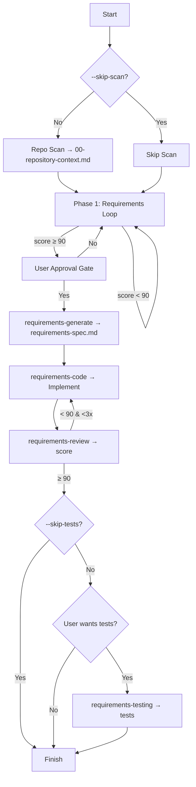

# `/requirements-pilot` 工作流与代理编排规范

> 面向实现的“需求驱动开发（Requirements-Driven Workflow）”命令与多智能体（Agents）编排说明。用于理解与二次开发，便于你创建自定义工作流或代理。

## 1. 概览

- 目标：从一句需求描述到可工作的代码，以最小工作流开销完成“需求 → 实现 → 评审 → 测试”。
- 原则：KISS、YAGNI、DRY；重视可实现性与与现有代码库的一致性，避免过度架构。
- 质量门控：
  - 需求质量 ≥ 90 分后进入“用户审批门”。
  - 代码评审得分 ≥ 90% 才进入“测试决策门”。
- 关键停顿：用户审批门（需求确认后必须等待用户确认才进入实现）。

## 2. 命令与参数

```
/requirements-pilot <FEATURE_DESCRIPTION> [OPTIONS]

Options:
  --skip-tests  # 跳过测试阶段
  --skip-scan   # 跳过仓库扫描（不推荐）
```

输入处理规则：
- 生成 `feature_name`（kebab-case）并创建目录：`./.claude/specs/{feature_name}/`。
- 输入 > 500 字时先生成需求摘要并向用户确认摘要是否准确。
- 输入过于模糊时主动追问关键信息后再继续。

## 3. 分阶段流程

### Phase 0：仓库扫描（可跳过）
- 目的：理解项目类型、技术栈、目录结构、约定、依赖与集成点。
- 产物：`00-repository-context.md` 保存于 `./.claude/specs/{feature_name}/`。
- 影响：作为后续需求澄清与实现/评审/测试的上下文。

### Phase 1：需求确认（循环直到 ≥ 90 分）
- 内容：结合仓库上下文对功能、约束、边界、验收标准做明确化。
- 评分（100 分）：
  - 功能清晰度 30
  - 技术明确性 25
  - 实现完整性 25
  - 业务上下文 20
- 产物：`requirements-confirm.md`（包含原始请求、上下文影响、澄清轮次、评分与最终确认）。
- 门控：当质量 ≥ 90 分后，进入“用户审批门”。

### 🛑 用户审批门（强制停顿）
- 展示：最终需求摘要、评分、与现有代码库的集成方式。
- 提问：是否进入实现（yes/确认/proceed/continue 等肯定回复）。
- 行为：仅在用户明确同意后才能进入实现（Phase 2）。

### Phase 2：实现流水线（仅在审批通过后执行）
按如下子代理（sub-agents）链路执行，带有上下文传递：

1) `requirements-generate`（需求→技术规格）
   - 输入：`requirements-confirm.md` 与仓库扫描上下文。
   - 输出：`requirements-spec.md`（面向代码生成的技术规格，含文件路径/函数签名/接口定义/迁移脚本等）。

2) `requirements-code`（技术规格→工作代码）
   - 输入：`requirements-spec.md` 与代码库。
   - 输出：直接写入项目代码（遵循现有约定，避免过度抽象）。

3) `requirements-review`（务实代码评审）
   - 输入：`requirements-spec.md` 与实现代码。
   - 输出：评分与改进建议（直接输出，无文件持久化要求）。
   - 门控：得分 ≥ 90% → 进入“测试决策门”；否则回到 `requirements-code` 修正后再评审（最多 3 轮以避免无限循环）。

4) 测试决策门
   - 若包含 `--skip-tests`：直接完成工作流。
   - 否则：基于复杂度与风险给出“是否创建测试”的推荐并询问用户：
     - 用户同意 → 进入 `requirements-testing`。
     - 用户拒绝 → 直接结束。

5) `requirements-testing`（测试实现）
   - 输入：`requirements-spec.md` 与实现代码。
   - 输出：测试代码（单测/集成/E2E 的务实组合），直接写入项目测试目录。

## 4. 产物与文件结构

```
.claude/specs/{feature_name}/
├── 00-repository-context.md    # 仓库扫描（可选）
├── requirements-confirm.md     # 需求确认全过程与最终版本
└── requirements-spec.md        # 面向代码生成的技术规格
# 实现与测试：直接修改/新增到项目代码与测试目录
```

评审输出：直接在对话/终端中给出评分与问题列表（无需落盘）。

## 5. 子代理职责与接口

### 5.1 `requirements-generate`
- 职责：将确认后的需求转为“代码生成就绪”的技术规格。
- 关键特性：
  - 最小抽象、直接可实现；提供精确的文件/函数/接口/迁移指令。
  - 单文档策略：`requirements-spec.md` 汇集问题-方案-实现-校验。
- 输入：`requirements-confirm.md` 与仓库上下文。
- 输出：`requirements-spec.md`。

技术规格结构建议：
- Problem Statement / Solution Overview
- Technical Implementation（数据库/代码/接口/配置）
- Implementation Sequence（分步落地）
- Validation Plan（测试与验证）

### 5.2 `requirements-code`
- 职责：按技术规格在现有项目中落地代码，优先可读与一致性。
- 约束：
  - 避免过度架构；遵循现有命名、结构与错误处理模式。
  - 变更数据库优先建迁移、保持兼容与性能基本面。
- 输入：`requirements-spec.md` 与代码库。
- 输出：代码变更（直接写文件）。

### 5.3 `requirements-review`
- 职责：以“能用、可维护、集成良好”为核心进行实用主义评审。
- 评分构成：功能 40%、集成 25%、代码质量 20%、性能 15%。
- 阈值：≥ 90% 可进入测试决策门；否则给出具体修改意见并回流实现。
- 输出：总结 + 详细问题清单（含文件与行号引用为佳）。

### 5.4 `requirements-testing`
- 职责：以“关键路径优先、风险优先”为导向实现测试。
- 策略：单测（约 60%）、集成（约 30%）、端到端（约 10%）。
- 目标：覆盖关键业务、API、数据一致性、鉴权与错误场景。
- 输出：测试代码（直接写入项目测试目录），并验证执行。

## 6. 上下文传递与状态机

上下文传递：仓库扫描结果、项目约定、技术栈约束、确认需求与技术规格会在各代理之间串联传递。

状态机（简化伪代码）：

```pseudo
parse_options()
feature = to_kebab_case(FEATURE_DESCRIPTION)
ensure_specs_dir(feature)

if not --skip-scan:
  scan_repo() -> write 00-repository-context.md

score = 0
while score < 90:
  requirements = confirm_requirements_with_context()
  score = evaluate_requirements(requirements)
write requirements-confirm.md

ask_user_approval()
if not approved:
  goto requirements_loop

generate_spec()        # requirements-generate -> requirements-spec.md
implement_code()       # requirements-code -> write code

review_score = review_code()  # requirements-review
iterations = 0
while review_score < 90 and iterations < 3:
  address_feedback_with_code()
  review_score = review_code()
  iterations += 1

if --skip-tests:
  finish()
else:
  rec = smart_test_recommendation()
  if user_wants_tests(rec):
    implement_tests()  # requirements-testing
finish()
```

Mermaid 流程图（示意）：



## 7. 扩展与二次开发

- 添加/替换代理：
  - 在 `requirements-driven-workflow/agents/` 新增自定义代理 Markdown，定义 `name/description/tools` 与工作指令。
  - 在 orchestrator 命令（`requirements-pilot.md`）处调整编排顺序、门控阈值与交互提示。

- 自定义门控：
  - 修改需求评分维度与阈值（例如加入“安全/合规”加权）。
  - 调整评审循环次数或引入“高风险模块强制测试”规则。

- 插件注册：
  - 在 `.claude-plugin/marketplace.json` 新增/修改插件条目，指向你的命令与代理文件。
  - 参考《Plugin System Guide》使用 `/plugin install` 进行发布与安装。

- 产物约定：
  - 若需要固化评审/测试报告，可扩展为落盘到 `./.claude/specs/{feature_name}/`。

## 8. 设计原则与最佳实践

- 以实现为中心：技术规格必须“可直接翻译为代码”。
- 遵循现有项目约定：命名/结构/错误处理/日志/配置方式保持一致。
- 简化优先：能直给就直给，避免“为将来而设计”。
- 质量优先于速度：需求未达标或未获批准不得进入实现；评审不过线必须修正。
- 测试务实：关键路径覆盖到位，避免追求形式化的 100% 覆盖。

## 9. 示例

```
/requirements-pilot "实现 JWT 刷新令牌机制"

# 期望过程
# 1) 扫描仓库并生成上下文（可选）
# 2) 需求澄清至 ≥90 分并等待用户批准
# 3) 生成技术规格（含迁移/接口/函数签名）
# 4) 根据规格直接编码并提交变更
# 5) 评审 ≥90% 后进入测试决策门
# 6) 按推荐与用户选择执行测试或结束
```

---

通过本规范，你可以：
- 快速复用现有工作流并做定制（新代理、新门控、新产物）。
- 以“低抽象、高可实现”的方式落地日常需求到代码。
- 保持质量与效率平衡，支持渐进式的工程化演进。
